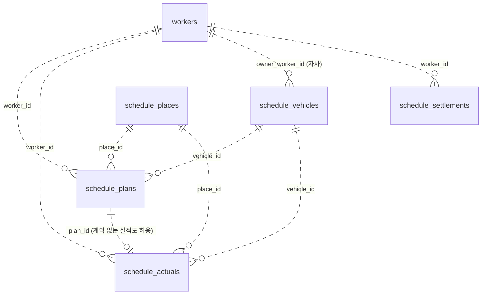
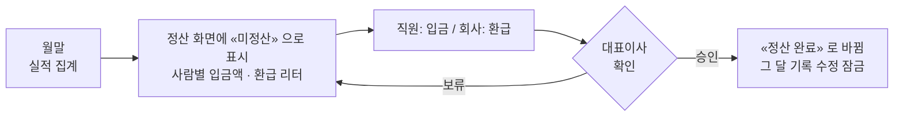

# 스케줄표 설계서

> 작성 2026-08-15(토) · **3판 — 설계 확정** · 바이트론 이앤에스

---

## 1. 무엇을 만드는가

직원이 **어느 날 어디에서 무엇을 할 계획인지** 달력에 입력하고, 그 계획이 실제와 같았는지 확인하는 화면입니다. 업무 내용을 상세히 적는 기존 「오늘 업무」와 달리 **장소와 이동 수단**이 중심입니다.

| # | 목적 | 달성 방법 |
| --- | --- | --- |
| 1 | 인원의 위치 파악 | 주간 뷰의 «사람 × 날짜» 격자 |
| 2 | 회사 차량 이용 스케줄 | 계획에 차량 지정, 겹치면 경고 |
| 3 | 이용 내역·거리·톨게이트·주유 정산 | 실적에 거리·비용 기록 → 월별 집계 → 대표이사 승인 |
| 4 | 장소를 고르면 거리·시간 자동 입력 | 장소 목록으로 관리해 두 번째부터 자동 |

### 1.1 이번 판에서 달라진 것

| 항목 | 1판 | **2판 (확정)** |
| --- | --- | --- |
| 운행일지(세무 양식) | 포함 — 계기판 전·후 입력 | **제외.** 요구가 생기면 그때 추가 |
| 정산 거리 근거 | 계기판 실측 | **스케줄에 입력한 km** |
| 자차 | 거리만 기록 | **거리 기록 + 주유 리터 환급** (차량별 연비 적용) |
| 정산 승인 | 없음 | **대표이사 전용 권한**으로 정산 완료 처리 |
| 개인 사용 | 달력에 미표시 | **달력에 표시하되 장소는 입력하지 않음** |

> **운행일지를 뺀 대가를 적어 둡니다.** 국세청 「업무용승용차 운행기록부」는 계기판 전·후 값과 출퇴근용/일반업무용 구분을 요구합니다. 이 시스템은 그 값을 받지 않으므로 **세무 제출 자료로는 쓸 수 없습니다.** 세무용 운행기록부는 지금처럼 Confluence 에서 계속 관리하시고, 이 시스템의 거리는 **사내 정산 근거**로만 씁니다. 나중에 필요해지면 실적 표에 계기판 두 칸을 더하는 것으로 확장할 수 있게 설계했습니다.

---

## 2. 데이터 모델

새 테이블 5개를 만들고, 직원 정보는 **기존 `workers` 를 그대로 씁니다.**



### 2.1 schedule_places — 장소 목록

지도 API 를 쓰지 않고 **한 번 입력해 계속 재사용**합니다.

| 컬럼 | 타입 | 설명 |
| --- | --- | --- |
| `id` | SERIAL PK |  |
| `name` | VARCHAR(200) UNIQUE | 표시 이름 (예: `삼양화학 인천공장`) |
| `address` | VARCHAR(300) | 주소 (참고용) |
| `distance_km` | NUMERIC(6,1) | 회사 → 장소 **편도** 거리 |
| `travel_min` | INTEGER | 편도 소요시간(분) |
| `category` | VARCHAR(20) | `사무실` · `고객사` · `현장` · `기타` |
| `active` | BOOLEAN | 쓰지 않는 장소 숨김 |
| `created_by` | INTEGER | 등록한 사람 (정리할 때 참고) |

**등록은 전원 가능하되, 비슷한 이름이면 경고합니다.**

| 검사 | 방법 |
| --- | --- |
| 같은 이름 | 그대로 거부 (UNIQUE) |
| 비슷한 이름 | 공백·괄호·「(주)」 등을 지우고 비교해 **부분 일치하면 경고** |
| 경고 문구 | 「⚠ 이미 «삼양화학 인천공장» 이 있습니다. 같은 곳이면 그것을 골라 주십시오」 |

> 「인천공장」·「삼양 인천」처럼 갈라지면 통계가 나뉘므로 **등록 시점에 막는 것**이 가장 값싼 방법입니다. 그래도 갈라진 것은 설정 탭에서 관리자가 합칩니다.

### 2.2 schedule_vehicles — 차량 (법인차 + 자차 통합)

법인차와 자차를 **한 표로 관리**합니다. 자차 환급을 차량별 연비로 계산해야 하기 때문입니다.

| 컬럼 | 타입 | 설명 |
| --- | --- | --- |
| `id` | SERIAL PK |  |
| `kind` | VARCHAR(10) | **`company`(법인차) · `own`(자차)** |
| `name` | VARCHAR(50) | `Model Y` · `카니발` · `QM6` · 자차 차종 |
| `plate` | VARCHAR(20) | 번호판 (자차는 선택) |
| `owner_worker_id` | INTEGER | **자차일 때 소유 직원** |
| `fuel_type` | VARCHAR(10) | `전기` · `가솔린` · `디젤` · `LPG` |
| `rate_per_km` | INTEGER | **법인차 개인사용 정산 단가(원/km)** — 현재 100 |
| `km_per_liter` | NUMERIC(4,1) | **자차 연비(km/L)** — 환급 리터 계산용 |
| `active` | BOOLEAN |  |

**초기 데이터 — 법인차 4대**

| 이름 | 번호판 | 연료 | 단가 | 근거 |
| --- | --- | --- | --- | --- |
| Model Y | 15도 3955 | 전기 | 100원/km | 정산기준 문서 |
| QM6 | 129누 9183 | — | 100원/km | 정산기준 문서 |
| 카니발 | 24구 7598 | — | 100원/km | **다른 차와 동일 적용** (정산기준 문서 없음) |
| 카니발 | 3422 | — | 100원/km | **다른 차와 동일 적용** (정산기준 문서 없음) |

> **카니발 2대는 정산기준 문서가 없어 우선 100원을 적용합니다.** 디젤이라면 실비는 이보다 큽니다(주행분만 약 135~145원/km 추정). **설정 화면에서 차량별 단가를 언제든 바꿀 수 있게** 만들어, 기준이 정해지면 코드 수정 없이 반영되도록 합니다. 단가 변경 권한은 대표이사입니다.

**자차 연비는 대표이사만 설정합니다.** 직원은 자기 차를 등록(차종·번호판)할 수 있지만 `km_per_liter` 는 수정할 수 없습니다. 환급 금액이 직접 걸린 값이기 때문입니다.

### 2.3 schedule_plans — 계획

| 컬럼 | 타입 | 설명 |
| --- | --- | --- |
| `id` | SERIAL PK |  |
| `worker_id` | INTEGER | 누구의 계획인가 |
| `plan_date` | DATE | 날짜 |
| `slot` | VARCHAR(10) | `allday` · `am` · `pm` · `time` |
| `start_time` `end_time` | TIME | `slot='time'` 일 때만 |
| `use_type` | VARCHAR(10) | **`business`(업무) · `personal`(개인 사용)** |
| `place_id` | INTEGER | 장소 목록 참조. **개인 사용이면 비움** |
| `place_text` | VARCHAR(200) | 목록에 없을 때 직접 입력 |
| `purpose` | VARCHAR(200) | 무엇을 할 계획인가. 개인 사용이면 비움 |
| `transport` | VARCHAR(20) | `office` · `company_car` · `own_car` · `transit` |
| `vehicle_id` | INTEGER | 차량 (법인차·자차 공용) |
| `est_distance_km` | NUMERIC(6,1) | 장소에서 자동 채움 |
| `est_travel_min` | INTEGER | 장소에서 자동 채움 |
| `round_trip` | BOOLEAN | 왕복이면 2배로 표시 |
| `status` | VARCHAR(10) | `planned` · `done` · `changed` · `canceled` |

### 2.4 schedule_actuals — 실적

**계기판 칸이 없습니다.** 거리를 직접 입력합니다(계획값이 기본으로 채워집니다).

| 컬럼 | 타입 | 설명 |
| --- | --- | --- |
| `id` | SERIAL PK |  |
| `plan_id` | INTEGER NULL | 계획 없이 생긴 일도 기록 |
| `worker_id` `work_date` | | 누가·언제 |
| `as_planned` | BOOLEAN | 계획대로였는가 |
| `use_type` | VARCHAR(10) | `business` · `personal` |
| `place_id` `place_text` `purpose` | | 실제 장소·업무 (개인 사용은 비움) |
| `transport` `vehicle_id` | | 실제 이동 수단·차량 |
| `distance_km` | NUMERIC(6,1) | **주행거리 — 정산 근거** |
| `toll_fee` | INTEGER | 하이패스 |
| `transit_fee` | INTEGER | 대중교통비 |
| `fuel_fee` | INTEGER | 주유·충전 실비 (법인차 업무용) |
| `memo` | TEXT | 비고 |
| `locked` | BOOLEAN | **정산 완료된 달은 수정 잠금** |

### 2.5 schedule_settlements — 월 정산 상태 (신규)

| 컬럼 | 타입 | 설명 |
| --- | --- | --- |
| `id` | SERIAL PK |  |
| `ym` | CHAR(7) | 정산 월 (`2026-08`) |
| `worker_id` | INTEGER | 대상 직원 |
| `personal_km` | NUMERIC(7,1) | 개인 사용 거리 합계 |
| `personal_amount` | INTEGER | **회사에 입금할 금액** |
| `toll_amount` | INTEGER | 개인 사용 하이패스 합계 |
| `own_car_km` | NUMERIC(7,1) | 자차 업무 사용 거리 |
| `own_car_liter` | NUMERIC(6,2) | **환급 리터** |
| `transit_amount` | INTEGER | 대중교통 실비 (회사가 지급) |
| `status` | VARCHAR(10) | **`open`(미정산) · `settled`(정산 완료)** |
| `settled_by` | INTEGER | 승인한 계정 |
| `settled_at` | TIMESTAMPTZ | 승인 시각 |
| `memo` | TEXT | 입금 확인 메모 등 |
| | | UNIQUE(`ym`, `worker_id`) |

금액은 **승인 시점 값을 박아 둡니다.** 나중에 단가가 바뀌어도 지난 정산액이 흔들리지 않게 하려는 것입니다(KPI 점수를 입력 시점 값으로 박아 두는 것과 같은 방침).

---

## 3. 정산 계산식

### 3.1 직원이 회사에 낼 돈 — 법인차 개인 사용

현행 규칙을 그대로 씁니다.

```
개인 사용 비용 = ( 개인 주행거리(km) × 차량 단가 ) + 하이패스 비용
              = ( km × 100원 ) + 하이패스
```

### 3.2 회사가 직원에게 줄 것 — 자차 · 대중교통

| 항목 | 계산 | 지급 형태 |
| --- | --- | --- |
| **자차 환급 리터** | `업무 주행거리 ÷ 그 차의 연비(km/L)` | **주유 한도(리터)** |
| 대중교통 | 입력한 실비 그대로 | 현금 |

```
예) 업무 주행 300km · 연비 12.5km/L  →  300 ÷ 12.5 = 24.0 L 주유 한도
```

> **금액으로 환산하지 않습니다.** 자차 환급은 현금이 아니라 **주유할 수 있는 리터 한도**로 주므로, 기준 유가를 두거나 금액을 계산할 필요가 없습니다. 정산 표에는 «환급 리터」만 표시합니다.

> **차량별 연비를 쓰는 이유** — 같은 거리를 달려도 차에 따라 필요한 기름이 다르므로, 연비로 나눠야 실제 소모량에 맞는 한도가 나옵니다. 연비는 환급량에 직접 영향을 주므로 **대표이사만** 바꿀 수 있습니다.

### 3.3 정산 흐름



| 상태 | 표시 | 누가 바꾸나 |
| --- | --- | --- |
| `open` | **미정산** (주황) | 자동 (월이 지나면 생성) |
| `settled` | **정산 완료** (초록) + 승인자·시각 | **대표이사만** |

정산 완료된 달의 실적은 **수정이 막힙니다.** 금액 근거가 나중에 바뀌면 안 되기 때문입니다. 잘못이 발견되면 대표이사가 잠금을 풀고 다시 승인합니다.

---

## 4. 권한 설계

### 4.1 지금 있는 계정 (실측)

| 아이디 | 이름 | 권한 |
| --- | --- | --- |
| `wjdduf9639@vi-tron.com` | 김정열 | admin |
| `ggyoon@vi-tron.com` | 윤기곤 | admin |
| `gunholee@vi-tron.com` | 이건호 | admin |
| 그 외 4명 | 김동현·송지형·윤인철·이상기 | viewer |

**대표이사 계정이 없습니다.** 다른 계정과 같은 방식으로 새로 만듭니다.

| 항목 | 값 |
| --- | --- |
| 이름 | **고광용** |
| 아이디 | **`sinoko@vi-tron.com`** |
| `role` | `admin` |
| `can_approve_settlement` | **`true`** (유일) |

> **계정 생성은 KPI 설정 화면에서 하시는 편이 좋습니다.** KPI 에 이미 「임시 비밀번호 발급 → 첫 로그인 때 본인이 변경」 흐름이 있습니다. 그 화면으로 계정을 만드시면 제가 `can_approve_settlement` 만 켜 드립니다. 비밀번호를 제가 만들어 넣지 않는 편이 안전합니다.

### 4.2 권한을 어떻게 나눌 것인가

요구는 **「일반 관리자에게는 정산 승인 권한이 없어야 한다」** 입니다. 그런데 `kpi_users` 는 KPI 추적 시스템과 **함께 쓰는 표**입니다.

| 방식 | 문제 |
| --- | --- |
| `role` 에 `ceo` 를 새로 추가 | KPI 쪽 코드가 `admin`·`member`·`viewer` 만 알아서, `ceo` 계정이 KPI 에서 권한 없는 사용자로 취급될 수 있습니다 |
| **`can_approve_settlement` 컬럼 추가 (제안)** | KPI 권한 체계를 건드리지 않습니다. 대표이사만 `true` |

**제안 — 권한을 «등급»이 아니라 «허가»로 둡니다.**

```sql
ALTER TABLE kpi_users ADD COLUMN can_approve_settlement BOOLEAN DEFAULT FALSE;
```

| 계정 | `role` | `can_approve_settlement` | 정산 화면에서 |
| --- | --- | --- | --- |
| 대표이사 (고광용) | admin | **true** | 전원 조회 + **승인** + **연비·단가 설정** + 잠금 해제 |
| 일반 admin (3명) | admin | false | 전원 조회만 — 승인·설정 불가 |
| viewer (4명) | viewer | false | 전원 조회만 |
| 로그인 안 함 | — | — | 정산 화면 진입 불가 (달력은 사용 가능) |

**개인 사용 내역은 로그인한 사람이면 모두 볼 수 있습니다.** 남는 정보가 «누가·언제·몇 km» 뿐이고 장소·용무는 애초에 받지 않으므로 사생활 문제가 없다는 판단입니다. 대신 **승인과 설정 변경만** 대표이사로 제한합니다.

이렇게 하면 KPI 시스템은 지금 그대로 돌아가고, 정산 승인만 따로 통제됩니다.

---

## 5. 화면 설계

기존 탭 옆에 **「스케줄」** 을 추가합니다.

```
오늘 업무 │ 일간 │ 주간 │ 월간 │ 연간 │ 스케줄 │ 설정
```

### 5.1 달력 뷰 네 가지

| 뷰 | 구성 | 쓰는 상황 |
| --- | --- | --- |
| **월** | 날짜 격자, 칸마다 사람별 배지 | 한 달 흐름·차량 예약 현황 |
| **주** | **«사람 × 날짜» 격자** | **누가 어디 있는지 파악 (목적 1)** |
| **일** | 그날 전원 목록 + 배차 표 | 아침 배차 확인 |
| **연** | 월별 외근 일수 요약 | 연간 추이 |

| 이동 수단 | 배지 |
| --- | --- |
| 사무실 | 🏢 |
| 법인차량 | 🚗 + 차량 약칭 |
| 자차 | 🚙 |
| 대중교통 | 🚌 |
| **개인 사용** | 🅿 **「개인 사용」 + 차량만** (장소·업무 없음) |

### 5.2 계획 입력 폼

| 순서 | 입력 | 동작 |
| --- | --- | --- |
| ① | 이름 | 자기 이름을 고릅니다 |
| ② | 구분 | **업무 / 개인 사용** |
| ③ | 시간대 | 종일 / 오전 / 오후 / 시각 지정 |
| ④ | 장소 | 목록에서 고르거나 새로 추가 — **개인 사용이면 이 칸이 나오지 않습니다** |
| ⑤ | 업무 | 한 줄 설명 — 개인 사용이면 나오지 않음 |
| ⑥ | 이동 수단 | 사무실 / 법인차량 / 자차 / 대중교통 |
| ⑦ | 차량 | 법인차량·자차일 때. **겹치면 즉시 경고** |
| — | 거리·시간 | ④에서 자동으로 채워짐 (수정 가능) |

**개인 사용을 고르면 장소·업무 칸이 사라집니다.** 정산에 필요한 것은 차량과 거리뿐이고, 사적인 행선지를 시스템에 남기지 않는 편이 낫다는 판단입니다.

### 5.3 차량 예약 겹침

**먼저 등록한 사람 우선 + 경고 표시** (관리자 승인 없음).

| 상황 | 화면 |
| --- | --- |
| 같은 날·차량이 이미 있음 | 「⚠ 이미 OOO 님이 예약했습니다 — 그래도 등록하시겠습니까?」 |
| 등록 후 | 배지에 겹침 표시, 일 뷰 배차 표에 빨간 줄 |

### 5.4 실적 입력

| 입력 | 비고 |
| --- | --- |
| 계획대로 / 달랐음 | 「계획대로」는 한 번 눌러 끝 |
| 주행거리(km) | **계획값이 기본으로 들어감**, 실제와 다르면 고침 |
| 하이패스 | 원 단위 |
| 주유·충전 | 법인차 업무용 실비 |
| 대중교통비 | 대중교통일 때만 |

### 5.5 정산 화면 (로그인)

| 구역 | 내용 |
| --- | --- |
| 월 선택 | 기본은 지난달 (익월 초 정산이라는 현행 규칙에 맞춤) |
| **사람별 표** | 개인 사용 km · 단가 · 하이패스 → **입금액** / 자차 업무 km · 연비 → **환급 리터** / 대중교통 실비 |
| **차량별 표** | 총 주행 · 업무 · 개인 · 하이패스 · 주유(충전) |
| 상태 | **미정산 / 정산 완료** (승인자·시각 함께) |
| 승인 버튼 | **대표이사에게만 보입니다** |
| 안내 | 현행 입금 계좌 문구를 그대로 표시 |
| 내보내기 | CSV (사내 정산 보고용) |

---

## 6. 기존 Confluence 자료

| 대상 | 처리 |
| --- | --- |
| **운행일지** | **그대로 둡니다** — 세무용 운행기록부는 계속 Confluence 에서 관리 |
| 일정관리 | 스케줄 화면으로 옮김 |
| 운행안내 · 충전안내 · 정산기준 | 그대로 둠 (설명 문서) |

1판에서는 운행일지를 이전한다고 했으나, **운행일지를 시스템에 넣지 않기로 하여 이전 대상이 없습니다.**

---

## 7. 만들 순서

| 단계 | 내용 |
| --- | --- |
| **1** | 테이블 5개 생성 + `kpi_users.can_approve_settlement` 추가, 차량 4대·초기 장소 등록 |
| **2** | 백엔드 API — 장소·차량·계획·실적 CRUD, 유사 이름 검사, 차량 겹침 검사 |
| **3** | 달력 화면 4개 뷰 |
| **4** | 계획 입력 (업무/개인 구분, 차량 겹침 경고) |
| **5** | 실적 입력 |
| **6** | 정산 화면 + 로그인 + 대표이사 승인 |

1단계 범위는 **1~5**, 정산(6)은 한 달 데이터가 쌓인 뒤 붙입니다. 다만 정산에 쓸 컬럼은 처음부터 넣어 두어 나중에 스키마를 다시 고치지 않게 합니다.

---

## 8. 결정된 사항

| 항목 | 결정 |
| --- | --- |
| 화면 위치 | 대시보드. 정산 화면만 로그인 |
| 거리 계산 | 지도 API 없이 장소 목록 재사용 |
| 운행일지 | **넣지 않음** (요구 시 추가) |
| 정산 근거 | **스케줄에 입력한 km** |
| 자차 | 거리 기록 + **연비로 주유 한도(리터) 환급**, 금액 환산 없음. 연비 설정은 대표이사만 |
| 개인 사용 | 달력에 표시, **장소 입력 없음**, 내역은 로그인 전원 조회 가능 |
| 정산 승인 | **대표이사(고광용) 전용** — `can_approve_settlement` |
| 계획 입력 시점 | 제약 없음 |
| 장소 등록 | 전원 가능 + **유사 이름 경고** |
| 차량 겹침 | 먼저 등록한 사람 우선 + 경고 |
| 계정 | KPI 계정(`kpi_users`) 재사용, 대표이사 계정 신설 |
| 부서 | `workers.team` 사용 — 재직 7명 전원 입력돼 있음 |

## 9. 확인 사항 — 전부 정리되었습니다

| 사항 | 결정 |
| --- | --- |
| 카니발 2대 단가 | **100원/km (다른 차와 동일)**, 설정 화면에서 변경 가능 |
| 정산 완료 후 수정 | **잠금.** 정정이 필요하면 대표이사가 잠금을 풀고 **재승인** |
| 대표이사 계정 | **고광용 · `sinoko@vi-tron.com`** — KPI 설정 화면에서 생성 후 승인 권한만 부여 |
| 자차 환급 형태 | **주유 한도(리터)** — 현금 아님 |
| 기준 유가 설정 | **불필요** — 금액으로 환산하지 않음 |
| 개인 사용 조회 범위 | **로그인한 사람 전원 조회 가능** |
| 운행일지(세무) | **넣지 않음** — Confluence 에서 계속 관리 |
| 출퇴근 기록 | 넣지 않음 (운행일지 영역) |
| 계획 입력 시점 | 제약 없음 |

**설계 확정.** 다음은 1단계(테이블 생성)입니다.

---

_이 문서는 검토용입니다. 승인 후 코드를 작성하며, 확정 내용은 Confluence 문서 체계에 반영합니다._
